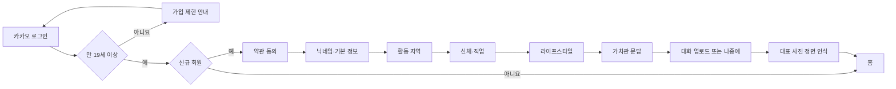
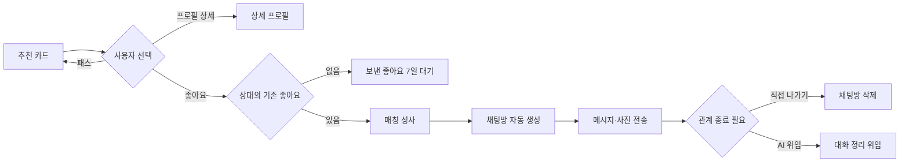
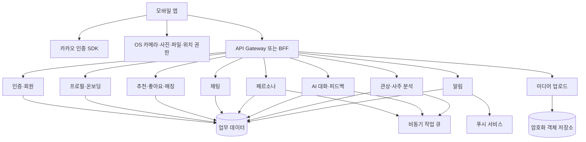

# 소개팅팅 프로젝트 설계서

## 0. 문서 정보

| 항목 | 내용 |
|---|---|
| 문서 버전 | v0.3 (무료 이용 정책 및 MVP·V1~V3 로드맵 반영) |
| 작성일 | 2026-08-28 |
| 기준 원본 | [Figma 화면설계서](https://www.figma.com/design/VVcLQWy8vQxZaECt7RKng0/%EA%B8%B0%ED%9A%8D-%EB%AC%B8%EC%84%9C?node-id=13-7678) |
| 분석 범위 | `화면설계서` 페이지의 모바일 화면 97개, 화면정의서 56개, MVP·V1~V3 단계 계획 |
| 제품명 | **소개팅팅** |
| 지원 형태 | 390px 폭 기준 모바일 앱 UI. 네이티브/크로스플랫폼 여부는 미정 |

### 표기 규칙

- **확정**: 화면정의서에 명시된 내용.
- **설계 제안**: 구현 가능성과 운영 안정성을 위해 본 문서에서 보완한 내용.
- **확정 필요**: 원본에서 미정이거나 서로 충돌하는 내용.

---

## 1. 프로젝트 개요

### 1.1 서비스 정의

사용자가 프로필과 가치관을 등록하고 이성 프로필을 탐색하여 좋아요·매칭·채팅으로 관계를 시작하는 모바일 매칭 서비스다. 일반적인 매칭 기능에 다음 AI 기능을 결합한다.

- 사용자의 문답과 대화 파일을 학습한 **내 페르소나**
- 두 페르소나가 자동 대화하는 **AI 가상 소개팅**과 궁합 리포트
- 상대 페르소나와 직접 연습하는 **연습 대화**와 대화 피드백
- 사진 기반 **관상 분석·궁합 추천**
- 생년월일시 기반 **사주 풀이·궁합 추천**

### 1.2 핵심 가치

1. 프로필 조건뿐 아니라 가치관·말투·대화 방식까지 반영한 추천을 제공한다.
2. 실제 상대에게 연락하기 전에 AI 시뮬레이션과 연습 대화로 부담을 낮춘다.
3. 관상·사주 콘텐츠로 새로운 탐색 경로와 참여 기회를 제공한다.
4. 차단, 신고, 데이터 삭제, 원본 미보관 등 신뢰·안전 장치를 제품 흐름에 포함한다.

### 1.3 범위

#### 최종 제품 범위

- 카카오 소셜 로그인과 만 19세 이상 가입 제한
- 약관 동의, 프로필·지역·라이프스타일·가치관·사진 온보딩
- 추천 피드, 이상형 필터, 프로필 상세, 패스·좋아요
- 받은/보낸 좋아요, 매칭, 채팅, 사진 전송
- AI 가상 소개팅, 연습 대화, 페르소나 학습·특성 관리
- 관상·사주 분석 및 궁합 기반 추천
- 알림, 프로필 수정, 차단 목록, 분석 기록 관리
- AI 대화 정리 위임

#### 현재 설계에서 제외 또는 미정

- 관리자·운영자 백오피스
- 고객센터/신고 처리 운영 화면
- 계정 설정·탈퇴의 독립 화면
- 추천·궁합 점수의 상세 산식
- 앱 기술 스택과 배포 인프라 제품 선정

### 1.4 출시 단계 원칙

기존 Figma는 최종 기능을 한 번에 설명하고 있어 개발·검증 순서가 보이지 않는다. 이를 **MVP → V1 → V2 → V3**로 분리한다.

- **MVP**는 완성된 버전이 아니라 핵심 가설을 검증하는 얇은 세로 슬라이스다. 가입→추천→좋아요→매칭→텍스트 채팅이 실제로 이어지고, 기본 문답으로 만든 페르소나가 제한된 AI-User 대화에 반영되는지 검증한다.
- **V1**은 매칭 서비스의 기본 제품 완성 단계다. 로그인·온보딩·메인·좋아요·채팅·마이페이지·알림을 운영 가능한 수준으로 완성하고 AI 페르소나·AI 대화·리포트를 출시한다.
- **V2**는 분석 기반 확장 단계다. V1에서 미리 개발한 채팅 종료 AI를 사용자 기능으로 연결하고, 관상(VLM)·사주·궁합을 제품에 통합한다.
- **V3**는 셀프서비스·고급 비전 AI 단계다. 프로필 수정, 페르소나 관리, 차단, 데이터 관리를 완성하고 선택적 얼굴 인식·AI 이미지·얼굴 취향 추천을 도입한다.
- 각 단계는 **풀스택 제품 트랙**과 **AI 역량 트랙**을 분리한다. AI 모델·평가·프롬프트는 다음 버전의 UI보다 한 단계 먼저 준비할 수 있다.

### 1.5 단계별 범위 요약

| 단계 | 제품 목표 | 풀스택 범위 | AI 범위 |
|---|---|---|---|
| MVP | 핵심 매칭 루프와 AI 가치 가설 검증 | 카카오 로그인, 최소 약관·온보딩, 기본 피드·프로필, 좋아요·상호 매칭, 텍스트 채팅, 축소형 마이, 최소 알림 | 온보딩 기본 문답 기반 페르소나 초안, 제한된 AI-User 대화 실험, 필수 정면 판단 |
| V1 | 기본 매칭 제품 정식 완성 | 로그인·온보딩·메인·좋아요·채팅·마이페이지·알림의 전체 상태·오류·빈 화면·복구 | 내 페르소나 생성·기본 수정, 카카오톡 txt 말투 학습, AI-AI 대화, AI-User 대화, 대화 기반 리포트, 채팅 종료 위임 엔진, 정면 판단 고도화 |
| V2 | 분석 콘텐츠와 AI 종료 위임 출시 | 관상 매칭, 사주 해석·사주 궁합, 채팅 종료 위임 UI·API·알림 통합 | 사주 풀이·궁합 생성, 관상 프롬프트/VLM, 종료 위임 정책 모델. 기능별 사용자·일자 이용 한도와 테스트 쿼터 적용 |
| V3 | 셀프서비스·고급 비전 AI | 마이페이지 확장: 프로필 정보 수정, 페르소나 관리, 차단, 데이터 관리 | 선택적 얼굴 인식과 인증 뱃지, AI 이미지, 얼굴 취향 추천, 비용 절감·모델 교체·학습/튜닝 |

### 1.6 MVP에 포함하지 않는 기능

- AI-AI 가상 소개팅의 정식 8라운드 경험과 궁합 리포트
- 카카오톡 txt 말투 학습과 상세 페르소나 관리
- 채팅 사진 전송·정리 위임·차단·데이터 관리
- 관상·사주
- 얼굴 인식 인증, AI 이미지 생성, 얼굴 취향 추천

MVP에서 이 기능들의 데이터 모델을 미리 완성할 필요는 없지만, 회원·프로필·대화·AI 세션 식별자는 후속 버전에서 마이그레이션 가능하게 설계한다.

---

## 2. 사용자와 권한

| 사용자 상태 | 가능한 행동 | 제한 |
|---|---|---|
| 비로그인 | 카카오 로그인 | 나머지 기능 접근 불가 |
| 가입 제한 | 확인된 생년월일 확인, 로그인으로 복귀 | 만 19세 미만은 가입 불가, 확인 정보 즉시 폐기 |
| 온보딩 중 | 약관·프로필·가치관·사진 등록 | 서버에 마지막 완료 단계를 보관하여 복귀 |
| 일반 회원 | 추천, 좋아요, 매칭, 채팅, 마이페이지 | 일일 좋아요 및 AI 기능 이용 한도 적용 |
| 페르소나 활성 회원 | 시뮬레이션·연습 대화 | 상대 페르소나 비활성 시 일부 기능 제한 |
| 차단 관계 | 차단 목록 관리 | 양방향 추천·궁합 목록 제외, 기존 대화 복구 불가 |
| 탈퇴 상대와 연결된 회원 | 과거 대화 확인 정책에 따라 제한 | 프로필을 `알 수 없음`으로 대체하고 입력 비활성 |

---

## 3. 정보 구조

### 3.1 전역 내비게이션

하단 탭 4개를 공통 셸로 사용한다.

| 탭 | 주요 기능 | 대표 화면정의서 |
|---|---|---|
| 홈 | 추천 피드, 프로필 상세, 이상형 필터, AI 분석 모드 | `S-main-01~04` |
| 좋아요 | 받은 좋아요, 보낸 좋아요, 매칭 전환 | `S-like-01~02` |
| 채팅 | 채팅 목록, 채팅방, AI 대화 정리 위임 | `S-chat-01~04`, `S-exit-01~02` |
| 마이 | 프로필·페르소나·알림·차단·데이터 | `S-my-*`, `S-persona-*`, `S-noti-01`, `S-data-01` |

### 3.2 도메인별 화면 맵

| 도메인 | 화면정의서 | 실제 화면 프레임 예시 |
|---|---|---|
| 인증 | `S-auth-01~02`, `S-error-component` | 00 로그인, 00-1 가입 제한 |
| 온보딩 | `S-onb-01~06`, `S-photo-01` | 01 약관 동의 ~ 10-5 AI 정면 인식 통과 |
| 홈·추천 | `S-main-01~04` | 07 홈, 07-4/5 프로필 상세, 07-6 선호 설정, AI 분석 선택 |
| 좋아요 | `S-like-01~02` | 08 받은 좋아요, 09 보낸 좋아요, 빈 상태 |
| AI 대화 | `S-ai-01~04` | AI 가상 소개팅, 연습 대화, 궁합 리포트, 피드백 |
| 채팅 | `S-chat-01~04` | 10 채팅 목록·빈 상태, 11 채팅방·더보기 |
| 대화 정리 | `S-exit-01~02` | 11-3~11-9 설정·미리보기·진행·완료·차단 |
| 마이 | `S-my-01~03` | 13 마이페이지, 프로필 수정, 차단 목록 |
| 알림·데이터 | `S-noti-01`, `S-data-01` | 알림 목록·삭제·빈 상태, 분석 기록·삭제 |
| 페르소나 | `S-persona-01~04` | 활성/비활성, 업로드, 문답, 내 페르소나 성격 |
| 관상 | `S-face-11~19` | 사진 선택·업로드·분석·결과·추천·상세 |
| 사주 | `S-saju-11~15` | 정보 입력·풀이·추천·궁합·프로필 |

---

## 4. 핵심 사용자 여정

### 4.1 가입과 온보딩

핵심 상태는 서버에 온보딩 단계 번호로 저장한다. 단, `S-onb-06` 문답 구간은 중도 이탈 시 답변을 폐기하고 라이프스타일 단계부터 재개한다.

### 4.2 탐색·좋아요·매칭·채팅

### 4.3 AI 대화 기능

- **가상 소개팅**: 홈 카드 → 이용 한도 확인 → 두 AI가 8라운드 자동 대화 → 궁합 리포트 저장 → 좋아요 또는 전체 대화 보기.
- **연습 대화**: 홈 카드 → 이용 한도 확인 → 사용자와 상대 페르소나가 최대 20턴 대화 → 피드백 저장 → 재연습 또는 좋아요.
- 둘 다 실제 상대에게 대화 내용이 전달되지 않음을 상시 고지한다.

### 4.4 관상 분석

`AI 분석 선택 → 사진 출처 선택 → 사진 선택/업로드 → 촬영 조건 확인 → 이용 한도 확인 → 분석 → 결과 저장 → 관상 궁합 추천 → 상대 상세`

분석 취소·실패 시 작업을 안전하게 종료하고 재시도를 제공하며, 99% 이후 취소 버튼을 비활성화한다. 신규 사진 원본은 분석 직후 삭제하는 정책이다.

### 4.5 사주 분석

`AI 분석 선택 → 이름·태어난 시간 입력 → 이용 한도 확인 → 사주 풀이 → 사주 궁합 추천 → 궁합 상세 → 상대 프로필`

생년월일과 성별은 본인인증 정보이므로 수정할 수 없다. 태어난 시간을 모르는 사용자는 시주를 제외하고 풀이한다.

## 5. 논리 시스템 아키텍처

기술 스택이 정해지지 않았으므로 다음은 **기술 중립적 논리 설계**다.

### 5.1 클라이언트 책임

- 카카오·OS 선택기 연동 및 콜백 처리
- 화면 상태, 입력 검증, 중복 탭 방지, 재시도 UI
- 커서 기반 무한 스크롤과 잔여 5장 선조회
- 비동기 작업의 진행률 폴링 또는 실시간 구독
- 온보딩 중단·AI 보류 세션 복구
- 접근 권한 거부 시 설정 이동 안내
- 민감정보와 원본 파일을 로컬 로그·분석 SDK에 남기지 않음

### 5.2 서버 책임

- 인증 토큰 검증, 회원 상태·온보딩 단계 관리
- 약관 버전·동의 시각의 감사 기록
- 추천·차단·패스·좋아요·매칭 원자성 보장
- 채팅 전송, 미읽음, 보관·삭제, 푸시 처리
- 페르소나·AI·관상·사주 비동기 작업의 멱등성, 실패 복구와 재시도 보장
- 파일 형식·용량·악성 파일 서버 검증과 개인정보 마스킹
- 알림·분석 기록 삭제 및 실행취소 보상 처리

### 5.3 비동기 작업 모델

| 작업 | 예상 시간 | 이탈 시 | 완료 통지 | 실패 처리 |
|---|---:|---|---|---|
| 대표 사진 정면 검사 | 2~5초 | 취소 가능, 뒤로가기는 제한 | 화면 자동 전환 | 15초 타임아웃, 재시도 |
| 페르소나 파일 학습 | 약 1~3분 | 백그라운드 계속 | 푸시·알림 | 원본 폐기, 오류 안내 |
| AI 가상 소개팅 | 30~60초 | 보류 또는 백그라운드 처리 | 리포트 화면·기록 | 중복 생성 방지, 재시도 |
| 연습 대화 응답 | 발화당 15초 타임아웃 | 24시간 보류 세션 | 화면 내 상태 | 턴 미소진, 재전송 |
| 관상 분석 | 약 30초 | 계속 실행, 완료 알림 | 푸시·알림 | 안전한 종료 후 재시도 |
| AI 대화 정리 | 수시간~1일 | 서버에서 계속 | 알림 | 상태별 운영 재처리 필요 |

### 5.4 AI 플랫폼·비용 최적화 설계

AI 기능별로 모델을 직접 호출하지 않고 공통 **AI Gateway**를 둔다. Gateway는 프롬프트 버전, 모델 라우팅, 토큰 예산, 캐시, 개인정보 제거, 안전 필터, 재시도와 비용 기록을 담당한다.

| 단계 | 기술 전략 | 비용 절감 방식 | 고도화 기준 |
|---|---|---|---|
| MVP | 파인튜닝 없이 고정 질문·구조화 프롬프트, 소형 모델 우선 | 제한된 턴·일일 쿼터, 응답 길이 상한, 동기 호출 최소화 | 페르소나 반영도·대화 만족도·발화 실패율 기준선 확보 |
| V1 | 프롬프트 레지스트리, JSON 구조화 출력, 기능별 모델 라우팅 | 요약 메모리, 공통 결과 캐시, AI-AI 비동기 실행, 리포트 1회 생성 후 재사용 | AI-AI/AI-User/리포트 자동평가와 사람 평가 세트 구축 |
| V2 | 사주 규칙 엔진+LLM 설명, 관상 VLM, 종료 위임 상태 머신 | 규칙 계산과 자연어 생성을 분리, 이미지 전처리 후 1회 VLM 호출, 저비용 모델 우선·실패 시 상위 모델 | 해설 일관성, 안전성, 실패율·재시도율 관리 |
| V3 | 얼굴 임베딩·선택적 인증, 이미지 생성, 얼굴 취향 추천 | 임베딩 사전 계산, 후보군 1차 검색 후 재랭킹, 이미지 생성 횟수·해상도 제한 | ROI가 확인된 기능만 파인튜닝·어댑터 학습 또는 모델 교체 |

#### 공통 비용 통제

- 사용자·기능·버전별 토큰/이미지/추론 비용 예산과 하드 리밋을 둔다.
- 동일 입력·동일 프롬프트 버전의 결과는 정책 허용 범위에서 재사용한다.
- 긴 대화는 전체 원문 대신 요약 메모리와 최근 N턴만 전달한다.
- 실시간성이 필요 없는 AI-AI 대화, 리포트, 관상·사주는 큐 기반 비동기 작업으로 처리한다.
- 모델 공급자를 추상화해 가격·성능 변화에 따라 교체 가능하게 한다.
- 프롬프트·모델·평가 데이터 버전을 결과에 기록하여 품질 회귀를 추적한다.
- 파인튜닝은 MVP부터 수행하지 않는다. 충분한 동의 데이터와 평가 기준, 비용 절감 효과가 확인된 뒤 V3에서 판단한다.

### 5.5 사진 확인 단계 분리

사진 관련 AI는 목적과 동의 수준을 분리한다.

1. **정면 판단 — 필수, MVP/V1**: 프로필 대표 사진의 얼굴 검출·정면 각도·가림·밝기·화질만 확인한다. 신원 동일성 판정이나 생체 인증으로 사용하지 않는다.
2. **AI 이미지 — V3**: 정면 판단을 통과한 뒤 온보딩/사진 확인 시퀀스에서 별도 선택 단계로 제공한다. 생성 이미지임을 명확히 표시하고 프로필 사용 허용 여부를 별도 확정한다.
3. **얼굴 인식 인증 — 선택, V3**: 사용자가 동의한 경우에만 추가 촬영/인증 사진과 대표 사진의 동일인 여부를 확인하고 인증 뱃지를 부여한다. 미선택 사용자의 기본 서비스 이용을 막지 않는다.
4. **얼굴 취향 추천 — V3**: 사용자의 좋아요·패스와 동의된 얼굴 임베딩을 이용한다. 관상(V2)의 해설형 콘텐츠와 별개 추천 모델로 관리한다.

---

## 6. 도메인 모델

| 엔터티 | 핵심 속성 | 관계·제약 |
|---|---|---|
| User | 사용자 ID, 카카오 식별자, 생년월일, 성별, 상태 | 만 19세 이상, 탈퇴·차단 상태 |
| Consent | 약관 유형, 버전, 동의 여부, 동의 시각 | 사용자별 버전 감사 기록 |
| OnboardingProgress | 마지막 완료 단계, 완료 여부 | 미완료 로그인 시 복귀 |
| Profile | 닉네임, 소개, 직업, 지역, 키, 체형, 학력, 생활 정보 | 닉네임 2~10자·중복 불가 |
| ProfilePhoto | 순서, 대표 여부, 인증 상태, 파일 참조 | 최대 6장, 대표 사진은 정면 검사 |
| Preference | 나이, 거리, 키, 지역 등 | 서버 저장, 피드 재로그인에도 유지 |
| RecommendationDecision | 대상, 패스/노출, 시각 | 패스한 대상은 재노출 금지 |
| Like | 발신자, 수신자, 상태, 만료 시각 | 최대 7일, 상호 좋아요 시 Match |
| Match | 두 사용자, 매칭 시각, 상태 | 채팅방 1개 생성 |
| ChatRoom | 참여자, 알림 상태, 종료·정리 상태 | 차단·나가기·탈퇴 처리 |
| Message | 발신자, 유형, 본문/파일, 상태, 시각 | 텍스트 최대 1,000자, 전송 재시도 |
| Persona | 활성 여부, 마지막 학습일, 버전 | 문답·파일·대화 관찰의 통합 결과 |
| PersonaTrait | 카테고리, 내용, 관찰 횟수, 신뢰 단계 | 관찰 5회 이상 `확신`, 삭제 가능 |
| PracticeSession | 상대, 사용 턴, 상태, 보존 만료 | 최대 20턴, 보류 24시간 |
| SimulationSession | 상대, 라운드, 상태, 결과 | 8라운드, 궁합 리포트 생성 |
| AnalysisJob | 관상/사주, 상태, 진행률, 원가 | 취소·실패 처리와 멱등성 필요 |
| AnalysisResult | 유형, 점수, 해설, 저장 상태 | 마이 > 데이터 관리에서 조회·삭제 |
| FaceVerification | 동의 버전, 상태, 대표 사진, 얼굴 템플릿 참조, 뱃지 | V3 선택 기능, 정면 판단 결과와 분리, 철회 시 템플릿 삭제 |
| GeneratedImage | 원본 참조, 스타일, 모델 버전, 생성물, 표시 상태 | V3, AI 생성 표기 필수, 얼굴 인증 근거 사용 금지 |
| FacePreferenceProfile | 사용자 선호 임베딩, 학습 신호 수, 버전, 활성 여부 | V3, 동의·초기화·추천 제외 지원 |
| AIModelRun | 기능, jobId, 모델·프롬프트 버전, 토큰/비용, 평가 상태 | 전 단계 공통 관측·비용·회귀 추적 |
| Notification | 유형, 제목, 대상 링크, 읽음·삭제 상태 | 필터·단일/전체 삭제 |
| Block | 차단자, 피차단자, 시각 | 양방향 추천·궁합 목록 제외 |

---

## 7. API 및 연동 설계

### 7.1 Figma에 명시된 API

| 도메인 | 메서드·경로 | 용도 |
|---|---|---|
| 인증 | `POST /api/v1/auth/social` | 카카오 토큰 교환, 신규/기존 분기 |
| 약관 | `POST /api/v1/terms/agree` | 동의 시각·버전 기록 |
| 프로필 | `GET /api/v1/users/nickname/check` | 닉네임 중복 검사 |
| 온보딩 문답 | `GET /api/v1/onboarding/questions` | 질문 세트 조회 |
| 온보딩 문답 | `POST /api/v1/onboarding/answers` | 답변 전송 |
| 사진 | `POST /api/v1/photos/verify` | 대표 사진 정면 검사 |
| 피드 | `GET /api/v1/feed?cursor=&size=20` | 추천 카드 조회 |
| 좋아요 | `GET /api/v1/likes/received?cursor=&size=20` | 받은 좋아요 조회 |
| 좋아요 | `GET /api/v1/likes/sent?cursor=&size=20` | 보낸 좋아요 조회 |
| 좋아요 | `DELETE /api/v1/likes/{likeId}` | 발신 취소 |
| 채팅 | `GET /api/v1/chats?cursor=&size=20` | 채팅방 목록 |
| 채팅 | `POST /api/v1/chats/{roomId}/messages` | 메시지 전송 |
| 시뮬레이션 | `POST /api/v1/simulation` | AI 가상 소개팅 실행 |
| 연습 대화 | `POST /api/v1/practice/sessions/{id}/messages` | 연습 메시지 전송 |
| 페르소나 | `POST /api/v1/persona` | 페르소나 생성·학습 시작 |
| 페르소나 | `GET /api/v1/persona/traits` | 특성 조회 |
| 페르소나 | `DELETE /api/v1/persona/traits/{traitId}` | 특성 삭제 |

### 7.2 API 공통 계약 제안

- 쓰기 API는 `Idempotency-Key` 또는 업무 참조 ID를 받아 중복 탭·재시도를 안전하게 처리한다.
- 오류 응답은 `code`, 사용자 메시지 키, 재시도 가능 여부, 추적 ID를 포함한다.
- 목록은 `items`, `nextCursor`, `hasNext`를 공통 사용한다.
- AI·분석 비동기 작업은 `jobId`, `status`, `progress`, `resultId`, `errorCode`, `retryable`을 반환한다.
- 시간은 서버 표준시로 저장하고 클라이언트 로컬 시간대로 표시한다.

---

## 8. 상태·오류·복구 설계

### 8.1 공통 화면 상태

모든 조회·제출 화면은 최소 다음 상태를 가진다.

`초기 → 로딩 → 성공(데이터/빈 상태) → 재시도 가능 오류`  
`입력 중 → 검증 중 → 제출 중(중복 조작 차단) → 성공/실패`  
`비동기 작업 대기 → 진행 → 완료/실패/취소/미확정`

### 8.2 공통 오류 문구

| 상황 | 사용자 메시지 | 동작 |
|---|---|---|
| 네트워크 오류 | `네트워크 연결을 확인해주세요` | 3초 토스트, 사용자 재시도 |
| 서버 5xx | `잠시 후 다시 시도해주세요` | 현재 입력·선택 유지 |
| 권한 거부 | `설정에서 권한을 허용해주세요` | 시스템 설정 이동 |
| AI 실행 실패 | `잠시 후 다시 시도해주세요` | 현재 상태 유지 후 재시도 |
| 업로드 실패 | `사진을 불러오지 못했어요` | 취소 또는 같은 파일 재시도 |

### 8.3 복구 처리

- AI 가상 소개팅 생성 실패: 결과를 저장하지 않고 동일 요청을 안전하게 재시도한다.
- 관상 분석 취소·실패: 작업을 안전하게 종료하고 같은 사진으로 다시 시도할 수 있다.
- 삭제 실행취소: 소프트 삭제 또는 3초 유예 후 확정 삭제 방식 권장.

---

## 9. 데이터 보관·개인정보 설계

| 데이터 | 원본 정책 | 보관 정책 |
|---|---|---|
| 소셜 로그인 생년월일 | 가입 가능 여부 확인 | 가입 제한 시 즉시 폐기, 가입 시 인증 정보로 저장 |
| 약관 동의 | 변경 불가 감사 데이터 | 동의 버전·시각 장기 보관 |
| 프로필 사진 | 사용자 공개 자산 | 삭제·교체 정책에 따름, 최대 6장 |
| 대표 사진 정면 검사 원본 | 검사 용도 | 실패 사진과 검사 원본 즉시 폐기 |
| 관상용 신규 사진 원본 | 분석 용도 | 분석 직후 삭제 |
| 카카오톡/대화 업로드 원본 | 페르소나 학습 | 내 발화 추출·개인정보 마스킹 후 원본 미보관 |
| 연습 대화 보류 세션 | 재개용 | 24시간 |
| 연습 대화 로그 | 피드백 재조회 | 30일 후 요약만 유지 |
| 좋아요 | 매칭 대기 | 최대 7일 |
| 채팅 | 사용자 대화 | 180일 경과 자동 삭제, 7일 전 경고 |
| 분석 기록 | 재조회 | 현재 90일 임시 표기, 확정 필요 |
| 페르소나 특성 | 추천·AI 사용 | 사용자 삭제 가능, 학습 원본과 분리 |
| 얼굴 인식 인증 사진 | V3 선택 동일인 확인 | 검증 후 원본 즉시 삭제 권장, 법무·정확도 요건에 따라 확정 |
| 얼굴 템플릿·임베딩 | V3 선택 인증 | 암호화·목적 분리, 동의 철회·탈퇴 시 삭제 |
| AI 이미지 원본·중간 산출물 | V3 생성 처리 | 생성 완료/실패 후 단기 삭제, 선택한 결과만 정책 기간 보관 |
| 얼굴 취향 임베딩 | V3 추천 | 사용자 비활성·초기화·동의 철회 시 삭제 |

### 9.1 필수 보안 원칙

- 액세스 토큰과 민감정보를 앱 로그와 분석 이벤트에 기록하지 않는다.
- 업로드 URL은 단기·단일 사용으로 발급하고 서버에서 MIME·확장자·용량을 재검증한다.
- 저장 파일과 주요 DB 컬럼은 전송·저장 구간 암호화를 적용한다.
- 차단·삭제·동의 변경은 감사 로그를 남긴다.
- 운영자 접근은 최소 권한과 승인·감사 체계를 적용한다.
- AI 학습·추천 입력 데이터와 사용자에게 노출되는 결과를 분리하고 원문 노출을 금지한다.

---

## 10. 비기능 요구사항

화면정의서에 정량 기준이 없는 항목은 출시 전에 별도 합의가 필요하다.

| 영역 | 설계 요구 |
|---|---|
| 성능 | 피드·목록은 커서 페이지네이션, 이미지 지연 로딩·캐시, 잔여 5장 선조회 |
| 안정성 | 좋아요·매칭은 멱등 처리하고 비동기 작업은 안전하게 재실행·복구 가능 |
| 가용성 | AI·분석 장애가 기본 추천·채팅 기능을 막지 않도록 격리 |
| 일관성 | 상호 좋아요→매칭→채팅방 생성은 하나의 업무 트랜잭션으로 처리 |
| 접근성 | 44px 이상 터치 영역, 상태를 색상만으로 구분하지 않음, 스크린리더 레이블 |
| 관측성 | 요청 추적 ID와 비동기 jobId를 연결해 상태·실패·재시도를 추적 |
| 국제화 | 현재 한국어 단일 언어지만 날짜·시간·통화 포맷은 로케일 계층으로 분리 |
| 개인정보 | 동의 목적별 처리, 삭제·보관 기한 자동화, 원본 미보관 검증 |

---

## 11. 분석 이벤트 설계 제안

개인정보 원문과 채팅 내용을 이벤트 속성으로 전송하지 않는다.

| 이벤트 | 주요 속성 |
|---|---|
| `login_attempted/completed/failed` | provider, 신규 여부, 오류 코드 |
| `onboarding_step_viewed/completed` | stepId, 소요 시간, 이탈 여부 |
| `feed_card_viewed/passed/liked` | 카드 위치, 추천 실험군, 결과 상태 |
| `match_created` | 유입 경로(피드/받은 좋아요/AI 리포트) |
| `chat_message_sent/failed` | 메시지 유형, 재시도 여부, 길이 구간 |
| `ai_session_started/completed/failed` | 기능 종류, 라운드/턴, 소요 시간, 재시도 여부 |
| `analysis_started/completed/canceled/failed` | 관상/사주, 소요 시간, 오류 분류, 재시도 여부 |
| `persona_learning_started/completed/failed` | 문답/파일, 파일 형식·용량 구간 |
| `notification_opened/deleted` | 알림 유형, 단일/전체 |
| `data_deleted/undo` | 데이터 유형, 범위 |

---

## 12. 운영·출시 설계 제안

### 12.1 기능 플래그

- AI 가상 소개팅, 연습 대화, 관상, 사주, 대화 정리 위임을 각각 독립 플래그로 운영한다.
- 점수·프롬프트·턴/라운드·이용 한도는 앱 배포 없이 서버 설정으로 조정한다.
- 상대 페르소나 활성 여부와 AI 기능 이용 가능 상태를 서버에서 내려준다.

### 12.2 운영 지표

- 가입 완료율과 단계별 이탈률
- 추천 카드→상세→좋아요→매칭 전환율
- 매칭 후 첫 메시지율과 7일 대화 유지율
- AI 기능 시작·완료·실패·재시도율, 평균 생성 시간
- 관상·사주 결과→프로필→좋아요 전환율
- 신고·차단·채팅방 나가기율
- 개인정보 삭제 SLA와 원본 미보관 검증 결과

### 12.3 단계 종료 기준

| 단계 | 다음 단계 진입 조건 |
|---|---|
| MVP → V1 | 가입→매칭→첫 채팅 전환을 계측할 수 있고 치명적 데이터 손실·중복 매칭이 없으며, 기본 페르소나 대화가 사전 정의된 품질 평가를 통과 |
| V1 → V2 | 핵심 매칭·채팅 운영 안정화, AI-AI/AI-User/리포트 비용 상한 준수, 채팅 종료 위임 AI의 오프라인 안전성 검증 완료 |
| V2 → V3 | 관상·사주·종료 위임의 사용률·완료율·안전성 기준 충족, 기능별 이용 한도와 모델 비용 상한을 준수 |
| V3 안정화 | 선택 얼굴 인식 동의·삭제 체계, AI 이미지 표기 정책과 얼굴 취향 추천의 사용자 제어 검토 완료 |

---

## 13. 주요 결정 필요 사항

### P0 — 구현 전 반드시 확정

1. **대화 데이터 학습 동의 충돌**: `S-onb-01`은 필수 약관으로 정의하지만 `S-onb-06`은 미동의 시 업로드를 건너뛴다고 정의한다. 선택 동의인지 필수 동의인지 법무·제품 합의가 필요하다.
2. **시뮬레이션 단위**: `S-ai-01`에 `20턴`과 `8라운드`가 혼재한다. 가상 소개팅은 8라운드, 연습 대화는 20턴으로 통일하는 안이 가장 일관적이다.
3. **차단·나가기 데이터 처리**: 채팅방 삭제가 사용자별 소프트 삭제인지 전체 삭제인지, 법적 보존 데이터가 무엇인지 확정한다.
4. **관상·사주 개인정보 처리**: 생체·민감정보 해당 여부, 처리 목적·보관 범위·삭제 증적을 법무 검토한다.
5. **얼굴 인식 선택 정책**: 정면 판단과 동일인 얼굴 인식을 법적·기술적으로 분리하고, 선택 동의·뱃지·철회·템플릿 삭제 정책을 확정한다.
6. **AI 이미지 사용 정책**: 생성 이미지의 프로필 사용 가능 여부, 원본/생성물 보관 기간, 워터마크·AI 생성 표기와 악용 방지 기준을 확정한다.

### P1 — 상세 설계 전 확정

1. 받은/보낸 좋아요 공개 범위와 블러 처리 정책.
2. AI 실행 사실을 상대에게 알릴지 여부와 중단·실패 시 재시도 기준.
3. 분석 기록 보관 기간, 전체 삭제 범위, 실행취소 노출 시간.
4. 설정·계정 탈퇴·고객센터·신고 화면 추가.
5. 관상·사주 추천의 초기 로드 건수, 페이지 크기, 전체 상한.
6. 프로필 완성도 산식과 전 항목 완료 시 카드 영역 처리.
7. 사주 오늘의 운세 갱신·저장 방식과 결과 저장 확인 정책.
8. 관상·사주 궁합 상세의 최종 서술 방식(불릿형/해설형).
9. 얼굴 취향 추천에 사용할 행동 데이터·얼굴 임베딩의 동의 범위와 추천 제외 기능.

### P2 — 품질 정리

1. 중복 화면정의서 ID `S-my-01`, `S-my-03` 정리.
2. 화면명·화면번호와 정의서 ID 매핑표 확정.
3. `S-chat-04`에서 채팅방을 `S-chat-02`로 참조한 오기 수정.
4. 음주·흡연은 `4종`으로 적혀 있으나 각 3개 선택지만 명시된 부분 보완.
5. AI 분석 선택 화면의 카드 탭 즉시 이동/선택 후 확정 중 하나를 선택.

---

## 14. 단계별 구현 로드맵

### 14.1 MVP — 핵심 가설 검증

#### 풀스택

1. 카카오 로그인·만 19세 제한·최소 약관
2. 닉네임·성별·생년월일·지역·대표 사진 1장 중심의 축소 온보딩
3. 추천 피드·프로필 상세·패스·좋아요·상호 매칭
4. 텍스트 전용 1:1 채팅
5. 축소형 마이페이지와 기본 푸시/알림 진입

#### AI

1. 온보딩 기본 문답으로 페르소나 초안 생성
2. 제한된 AI-User 대화로 페르소나 반영 여부 검증
3. 대표 사진 정면 판단

### 14.2 V1 — 코어 제품·AI 페르소나

#### 풀스택

1. 로그인·온보딩·메인·좋아요·채팅·마이페이지·알림의 빈 상태·오류·복구·페이지네이션 완성
2. 다중 사진, 상세 필터, 받은/보낸 좋아요, 채팅 사진 등 코어 기능 확장

#### AI

1. 내 페르소나 정식 생성과 기본 수정
2. 카카오톡 txt 업로드 기반 말투 학습
3. AI-AI 가상 소개팅, AI-User 연습 대화
4. 대화 기반 궁합 리포트와 연습 피드백
5. 채팅 종료 위임 AI 엔진·안전 정책 개발(사용자 기능 출시는 V2)
6. 정면 판단 정확도·실패 사유·원본 폐기 고도화

### 14.3 V2 — 관상·사주·채팅 종료 위임

#### 풀스택

1. 관상 사진 선택·분석·결과·관상 매칭
2. 사주 정보 입력·해석·사주 궁합·추천
3. 채팅 종료 위임 설정·미리보기·진행·완료·알림
4. 사용자·기능·일자별 이용 한도와 테스트 쿼터 적용

#### AI

1. 관상 프롬프트/VLM 파이프라인
2. 사주 규칙 계산·해설 생성·사주 궁합
3. V1에서 개발한 채팅 종료 위임 엔진 운영 적용

### 14.4 V3 — 마이페이지 확장·비전 AI

#### 풀스택

1. 프로필 정보 수정, 페르소나 관리 허브, 차단 목록, 분석 데이터 관리
2. 선택 얼굴 인식 동의·추가 인증·뱃지·철회
3. AI 이미지 생성·선택·표기 UI
4. 얼굴 취향 추천 설정·추천 이유·제외 기능

#### AI

1. 선택적 얼굴 인식과 동일인 검증
2. AI 이미지 생성
3. 얼굴 취향 임베딩 검색·추천·재랭킹
4. 모델 라우팅·교체, 캐시, 평가 자동화, 필요 시 학습/튜닝

### 14.5 일정 운영 원칙

- MVP와 각 버전은 날짜가 아니라 **종료 기준**을 통과해야 닫힌다.
- AI 트랙은 다음 버전의 제품 통합보다 먼저 오프라인 평가와 비용 상한을 통과해야 한다.
- AI 기능은 사용자·기능·일자별 이용 한도와 테스트 쿼터로 운영하고, 모델 비용 상한을 단계별로 검증한다.
- 기능이 늦어지면 버전 전체를 미루지 않고 독립 기능 플래그로 제외한다.
